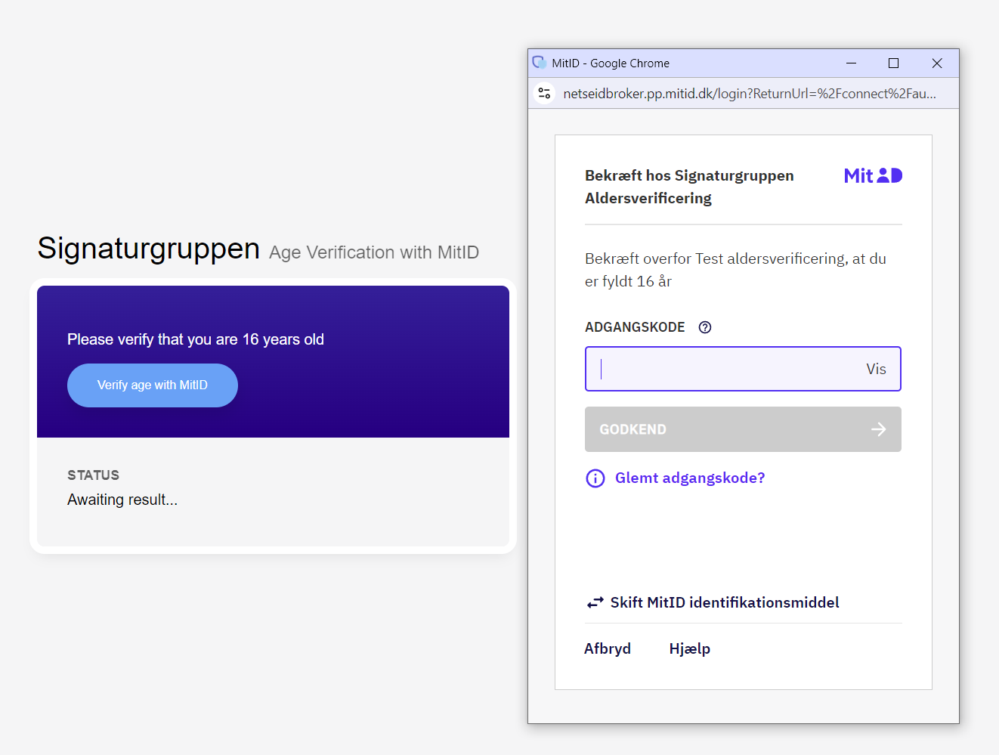

# Signaturgruppen Age Verification demo



## Updates
### 01-10-2024
We have added an update to the demo, as we have seen that Safari internal pop-up blocker has bloked the MitID pop-up because the pop-up was started inside a JS promise. 
We have updated the JS function: **sgBrokerStartAgeVerify** accordingly, by moving the pop-up code outside the returned promise in the code, which fixes this issue.

## Introduction
This example demonstrates a solution in pure vanilla JavaScript that integrates to Signaturgruppen Age Verification.

Setup for a predefined PP environment client, run the folder as a webapplication

See the sg-age-verify-config.js file for configuration parameters such as the age to verify and client id.

## Getting started
The example demonstrates how to setup a MitID age verification flow using only the included vanilla JavaScript to setup and verify the result. 
You need to serve the folder from a webserver in order to support the cross origin JavaScript (CORS) calls made from the example demo. 

### Quick testing on Windows
Windows has built-in support for Python, which is a very easy way to test the example. 
1. Clone or download to a folder
2. Open a prompt in the root of the example project (the one with index.html).
3. run 'python -m http.server 8000' (Windows will help the installation of Python)
4. open up http://localhost:8000

## MitID testusers. 
To test with MitID testusers in the PP environment, you can use one of our [prebuilt MitID testusers](https://signaturgruppen-a-s.github.io/signaturgruppen-broker-documentation/ageverification/age_verification.html#getting-started--open-quick-testing) or other any available MitID testuser.

## It works! Now what?
The example demo has demonstrated a full age verification flow and can be used as a template for the integration into your own service.

Please fully read and understand the [technical documentation](https://signaturgruppen-a-s.github.io/signaturgruppen-broker-documentation/ageverification/age_verification.html), which adresses the things you should consider before you can wrap up your integration.

## Documentation
https://signaturgruppen-a-s.github.io/signaturgruppen-broker-documentation/ageverification/age_verification.html

## Validation of ID token example
Here an example POST using the token verify API POST endpoint, which enables validation of the received ID token.
```
curl -X 'POST' \
  'https://pp.netseidbroker.dk/op/api/v1/tokenverify' \
  -H 'accept: text/plain' \
  -H 'Content-Type: application/json' \
  -d '{
  "idToken": "eyJh..jCwkJg"
}'
```
The response will be on the form: 

```
{
  "validated": true,
  "claims": {
    "iss": "https://pp.netseidbroker.dk/op",
    "nbf": "1726822698",
    "iat": "1726822698",
    "exp": "1726822998",
    "aud": "9d3c7..9b8",
    "nonce": "d....c",
    "sid": "0ed...f",
    "sub": "91a7..4",
    "auth_time": "1726822698",
    "idp": "idbrokerdk",
    "neb_sid": "0e..f",
    "transaction_id": "4f..d",
    "idtoken_type": "idbroker.dk",
    "idbrokerdk_age_verified": "18:true"
  }
}
```
